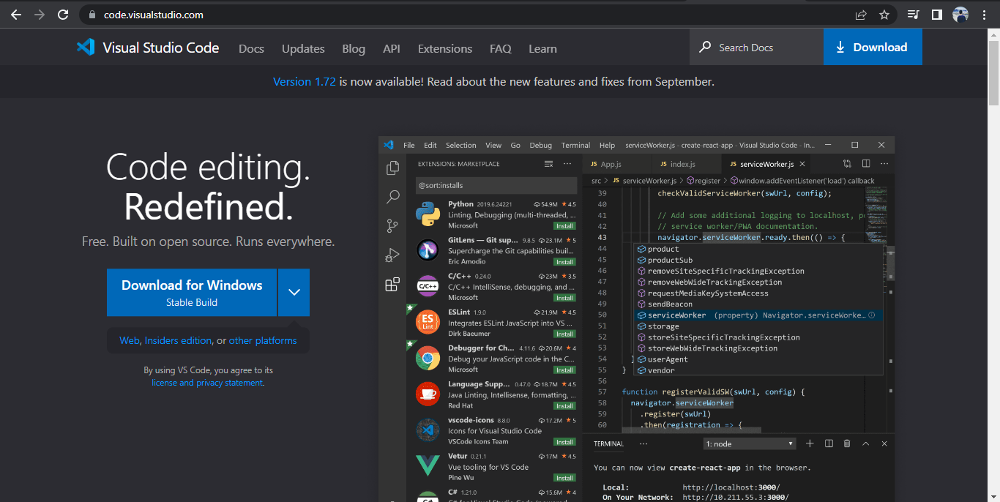

# Tugas Python Pertemuan 5
___
Nama    : Muhammad Rizky<br>
NIM     : 312210576<br>
Kelas   : TI.22.B2<br>
Mapel   : Bahasa Pemrograman<br>

**Daftar isi**
> * [Instalasi Tool](#installasi-tool)
> * [Latihan 1](#latihan-1)
> * [Latihan 2](#latihan-2)
> * [Latihan 3](#latihan-3)
  
## `Installasi Tool`
1. Download terlebih dahulu di web resminya [www.python.org](https://www.python.org/downloads/)
    
    
    
2. Setelah download selesai, install aplikasinya
   > centang bagian "Add python.exe to PATH"
    
    

3. Setelah instalasi selesai, disini saya menggunakan Text Editor yang bernama [Visual Studio Code](https://code.visualstudio.com/download) untuk mengetik script dan menjalankan programnya.
   > cara install [vscode](https://www.rsetiawan.com/2022/08/cara-install-visual-studio-code.html)
    
    

4. Setelah Vscode di install jalankan Aplikasinya dan install Extension Python
    
    

5. Buat 1 Folder bernama "lab2py" untuk menaruh tugas praktiknya
    
    

## `Latihan 1`
1. Buat file latihan1.py
   
    

2. Ketikan kode seperti dibawah ini
    ```python
    #menampilkan tulisan 'Hello' di layar
    print("Hello")
    #menampilkan tulisan 'Saya sedang belajar python' di layar
    print("Saya sedang belajar python")
    ```
3. Klik tombol Run atau klik F5, akan keluar sebuah terminal yang di dalamnya ada program yang kita tulisakan sedang di jalankan

    

## `Latihan 2`
1. Buat file latihan2.py
   
    

2. Ketikan kode seperti dibawah ini
    ```python
    # mendeklarasikan nilai 6 dan 8 di dalam variabel a dan b
    a = 6
    b = 8

    # Mencetak nilai variable a dan b
    print("Nilai variabel a = ", a)
    print("Nilai variabel b = ", b)

    # Mencetak hasil penjumlahan a+b
    print("hasil penjumlahan a + b = ", a+b)
    ```
3. Klik tombol Run atau klik F5, akan keluar sebuah terminal yang di dalamnya ada program yang kita tulisakan sedang di jalankan

    

## `Latihan 3`
1. Buat file latihan3.py
   
    

2. Ketikan kode seperti dibawah ini
    ```python
    #input nilai variabel
    a = input("masukan nilai a: ")
    b = input("masukan nilai b: ")

    #cetak nilai variabel
    print("variabel a = ", a)
    print("variabel b = ", b)

    #cetak hasil kedua operasi variabel dengan string format
    print("Hasil Penggabungan {1} & {0} = ".format(a,b) + str(a)+str(b))

    #konversi nilai variabel 
    a = int(a);
    b = int(b);

    print("Hasil penjumlahan {1} + {0} = %d".format(a,b) %(a+b))
    print("Hasil pembagian {1} / {0} = %d".format(a,b) %(a/b))
    ```
3. Klik tombol Run atau klik F5, akan keluar sebuah terminal yang di dalamnya ada program yang kita tulisakan sedang di jalankan

    